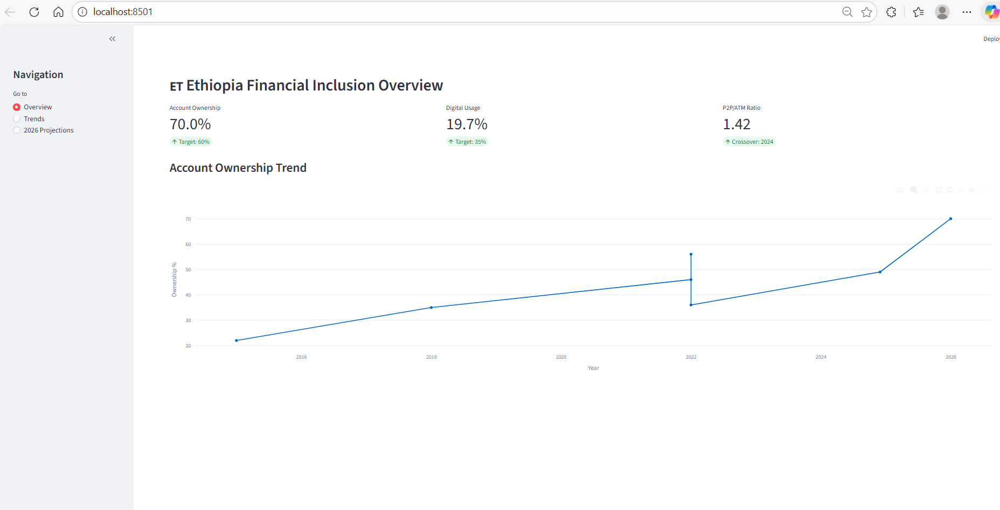
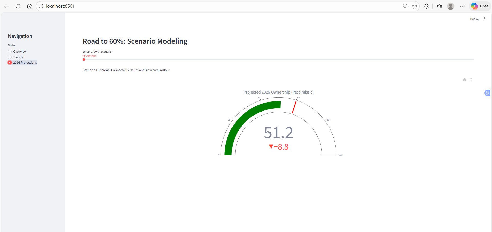

##### Follow these steps in your terminal or command prompt:

###### Activate your environment:

```
Bash
conda activate jupyter_env
```

###### Install Streamlit (if not already installed):

```
Bash
pip install streamlit openpyxl plotly
```

###### Navigate to your dashboard folder:

```
Bash
cd path/to/ethiopia_fi_project/dashboard
```

###### Run the app:

```
Bash
streamlit run app.py
```




